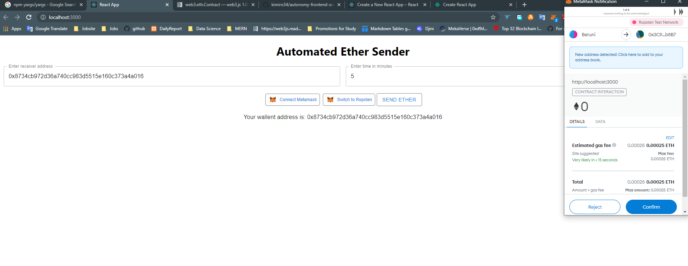

# Autonomy Network Frontend Defi Dapp Engineer Assessment Result



## Problem description

- https://github.com/Autonomy-Network/frontend-challenge

## My solution

### Create Project with creat react app

```
npx create-react-app my-app
cd my-app
npm start
```

### Used Theme

- Material-UI

### Get metamask wallet address && switch network to Ropsten testnet

- Connect to metamask

```js
if (window.ethereum) {
  //check if Metamask is installed
  try {
    //connect to site
    const address = await window.ethereum.enable(); //connect Metamask
    const obj = {
      connectedStatus: true,
      status: "",
      address: address,
    };
    console.log(address);
    setSender(address[0]);
    return obj;
  } catch (error) {
    return {
      connectedStatus: false,
      status: "🦊 Connect to Metamask using the button on the top right.",
    };
  }
} else {
  return {
    connectedStatus: false,
    status:
      "🦊 You must install Metamask into your browser: https://metamask.io/download.html",
  };
}
```

- Switch to Ropsten Network

```js
if (window.ethereum) {
  try {
    await window.ethereum.request({
      method: "wallet_switchEthereumChain",
      params: [{ chainId: "0x3" }],
    });
  } catch (switchError) {
    // This error code indicates that the chain has not been added to MetaMask.
    if (switchError.code === 4902) {
      try {
        await window.ethereum.request({
          method: "wallet_addEthereumChain",
          params: [
            {
              chainId: "0x03",
              rpcUrl:
                "https://ropsten.infura.io/v3/9aa3d95b3bc440fa88ea12eaa4456161" /* ... */,
            },
          ],
        });
      } catch (addError) {
        // handle "add" error
      }
    }
    // handle other "switch" errors
  }
} else {
  return {
    connectedStatus: false,
    status:
      "🦊 You must install Metamask into your browser: https://metamask.io/download.html",
  };
}
```

### Send transaction

- Create smart contract object using `web3.js` npm module, contract abis and `window.ethereum` object.
- Send transaction by calling `newReq` method of `Autonomy` contract deployed on Ropsten.

```js
if (window.ethereum) {
  var web3 = new Web3(window.ethereum);
  var ethSenderContract = new web3.eth.Contract(
    ethSenderABI,
    ethSenderContractAddress
  );
  var newReqContract = new web3.eth.Contract(newReqABI, newReqContractAddress);
  var time = min * 60;
  console.log();
  var callData = ethSenderContract.methods
    .sendEthAtTime(time, sender)
    .encodeABI();

  // using the event emitter
  newReqContract.methods
    .newReq(
      target,
      referer,
      callData,
      ethForCall,
      verifyUser,
      insertFeeAmount,
      payWithAUTO
    )
    .send({ from: sender })
    .on("transactionHash", function (hash) {})
    .on("confirmation", function (confirmationNumber, receipt) {})
    .on("receipt", function (receipt) {
      console.log("receipt", receipt);
      window.alert("NewReq method successfully called");
    })
    .on("error", function (error, receipt) {
      // If the transaction was rejected by the network with a receipt, the second parameter will be the receipt.
      window.alert("Error: ", error);
    });
} else {
  window.alert("You have to install Metamask!!!");
}
```

## How to run

- `npm install`
- `npm start`

Check out `http://localhost:3000` on your browser.

## Result transactions

- https://ropsten.etherscan.io/tx/0x8c3228ca37f24c3b4925b2a061ebf9ab7404ff455a4905d4abdffeb9bbefae95
- https://ropsten.etherscan.io/tx/0x1f8bfb47bccee5477850344d6f0079177d78a0ff95c16ecd3672f7222e1e2463
- https://ropsten.etherscan.io/tx/0x43e9a8d82373ca523f9eb0585fe61d229192e8f6e87ecb7a12ea97c89775efef
